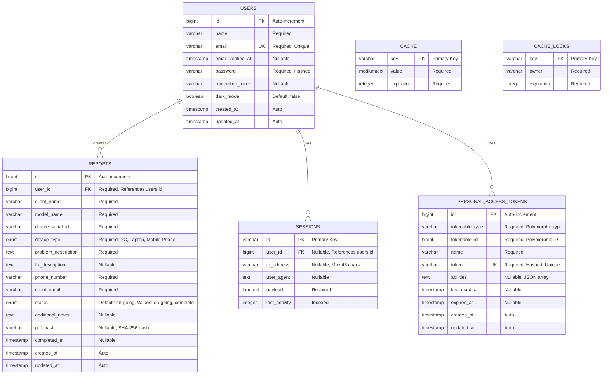

# Entity Relationship Diagram (ERD)
## Troubleshooting Report Management System

## Mermaid ERD Diagram

## Relationship Details

### Primary Relationships

1. **USERS → REPORTS (One-to-Many)**
   - **Cardinality**: 1:N
   - **Type**: Required relationship
   - **Foreign Key**: `reports.user_id` → `users.id`
   - **Cascade**: ON DELETE CASCADE (deleting a user deletes all their reports)
   - **Required**: Yes (every report must have a user)

2. **USERS → SESSIONS (One-to-Many)**
   - **Cardinality**: 1:N (optional)
   - **Type**: Optional relationship
   - **Foreign Key**: `sessions.user_id` → `users.id`
   - **Cascade**: None
   - **Required**: No (sessions can exist without authenticated users)

3. **USERS → PERSONAL_ACCESS_TOKENS (One-to-Many, Polymorphic)**
   - **Cardinality**: 1:N (optional)
   - **Type**: Optional relationship, polymorphic
   - **Polymorphic**: `tokenable_type` = 'App\Models\User', `tokenable_id` = `users.id`
   - **Cascade**: None
   - **Required**: No (tokens are optional, currently not actively used)

### System Tables (No Direct Business Relationships)

- **CACHE**: System table for application caching (no foreign keys)
- **CACHE_LOCKS**: System table for distributed locking (no foreign keys)

## Table Descriptions

### USERS Table
Stores user account information and authentication data.

**Key Fields:**
- `id`: Primary key, auto-incrementing
- `email`: Unique identifier for login
- `password`: Bcrypt hashed password
- `dark_mode`: User preference for dark mode theme

### REPORTS Table
Stores troubleshooting report data for devices.

**Key Fields:**
- `id`: Primary key, auto-incrementing
- `user_id`: Foreign key to users table
- `client_name`, `client_email`, `phone_number`: Client contact information
- `device_type`: Enum (PC, Laptop, Mobile Phone)
- `status`: Enum (on-going, complete)
- `pdf_hash`: SHA-256 hash for PDF verification
- `completed_at`: Timestamp when report was completed

### SESSIONS Table
Laravel session storage for user authentication and session data.

**Key Fields:**
- `id`: Session identifier (primary key)
- `user_id`: Foreign key to users table (nullable)
- `payload`: Serialized session data
- `last_activity`: Unix timestamp for session cleanup

### PERSONAL_ACCESS_TOKENS Table
Laravel Sanctum API token storage (exists but currently not actively used).

**Key Fields:**
- `id`: Primary key, auto-incrementing
- `tokenable_type`, `tokenable_id`: Polymorphic relationship to users
- `token`: Hashed API token (unique)
- `abilities`: JSON array of permissions
- `expires_at`: Optional token expiration

### CACHE Table
Laravel cache storage for application caching.

**Key Fields:**
- `key`: Primary key, cache key identifier
- `value`: Cached data
- `expiration`: Unix timestamp when cache expires

### CACHE_LOCKS Table
Laravel cache locks for distributed locking mechanism.

**Key Fields:**
- `key`: Primary key, lock key identifier
- `owner`: Lock owner identifier
- `expiration`: Unix timestamp when lock expires

## Notes

- The ERD focuses on the core business entities (USERS and REPORTS)
- SESSIONS, CACHE, CACHE_LOCKS, and PERSONAL_ACCESS_TOKENS are Laravel system tables
- PERSONAL_ACCESS_TOKENS table exists but is currently not actively used (would be used if API functionality is implemented)
- All timestamps use Laravel's automatic timestamp management
- Foreign key constraints ensure referential integrity
- CASCADE DELETE on `reports.user_id` ensures data consistency when users are deleted
- The `pdf_hash` field enables PDF integrity verification
- The `dark_mode` field allows per-user theme preference persistence
